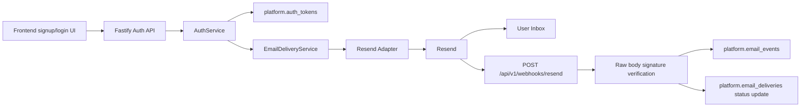

# Email Verification Architecture

Last updated: 2026-05-25

This document describes the implemented Resend-backed email verification architecture for Hawkaii HRMS. For staging and production operations, use the deployment runbook in `docs/runbooks/resend-email-verification-deployment.md`.

## Overview

Resend is the transactional email transport provider. The HRMS backend owns the security-critical verification system:

- token generation
- token hashing
- token expiry
- single-use verification
- resend cooldowns
- hourly and daily resend limits
- user verification state
- access control

Resend webhook events are delivery telemetry only. Webhooks never mark users verified. A user becomes verified only when they click an app-generated verification link and the backend validates the app-owned token.

## Source Of Truth

| Concern | Source |
| --- | --- |
| Verification/reset token truth | `platform.auth_tokens` |
| Email delivery attempts | `platform.email_deliveries` |
| Resend/Svix delivery events | `platform.email_events` |
| User verification state | `core.users.email_verified_at`, `core.users.email_verification_status` |
| Verification links | `FRONTEND_URL` |
| Webhook route | `POST /api/v1/webhooks/resend` |

Raw verification and reset tokens are not stored. `platform.auth_tokens.token_hash` stores the hash, while token metadata stores only non-secret context such as token purpose, company context, and hashed request metadata.

## Component Flow



## Signup And Verification

1. `POST /api/v1/auth/signup` creates or reuses the pending signup identity.
2. `AuthService` creates an `email_verification` token in `platform.auth_tokens`.
3. The raw token is sent only through `EmailDeliveryService`; production API responses do not expose it.
4. `EmailDeliveryService` builds a verification link from trusted `FRONTEND_URL`, not from the request host.
5. The Resend adapter sends the email and records a delivery row in `platform.email_deliveries`.
6. `POST /api/v1/auth/verify-email` hashes the submitted raw token, loads the active token, rejects used/revoked/expired tokens, marks the token used, and sets:
   - `core.users.email_verified_at`
   - `core.users.email_verification_status = 'verified'`

When the signup included a password, verification activates the user and creates the password credential. When signup did not include a password, verification issues a password setup step.

## Resend And Repeated Signup Limits

`POST /api/v1/auth/email-verifications/resend` is non-enumerating. Unknown, already verified, and suppressed paths return a generic accepted response and do not expose whether mail was sent.

The backend enforces per-email verification send controls:

- `EMAIL_VERIFICATION_RESEND_COOLDOWN_SECONDS`
- `EMAIL_VERIFICATION_RESEND_HOURLY_LIMIT`
- `EMAIL_VERIFICATION_RESEND_DAILY_LIMIT`

Repeated signup attempts for the same inactive pending/unverified user use the same verification-send path and cannot bypass these limits. Suspended or terminated users cannot use signup to trigger verification emails.

## Password Reset

Password reset uses the same delivery service path and the same `platform.auth_tokens` table. Password reset tokens are hashed, single-use, expire, and are sent through trusted `FRONTEND_URL` reset links. Production responses do not expose raw reset tokens.

## Webhook Processing

Resend webhooks are registered under:

```text
POST https://your-api-domain.com/api/v1/webhooks/resend
```

The route is public at the routing level so Resend can call it, but it is protected by Svix-style signature verification over the raw request body. Required headers are:

- `svix-id`
- `svix-timestamp`
- `svix-signature`

The verifier rejects missing or invalid headers, invalid signatures, and timestamps outside `RESEND_WEBHOOK_TIMESTAMP_TOLERANCE_SECONDS` seconds. The default and recommended tolerance is `300`.

Webhook events are deduplicated by provider event id, falling back to `svix-id` when needed. Valid duplicates return success without reprocessing. Events update `platform.email_events` and, when matched by Resend email id, update the corresponding `platform.email_deliveries` status.

Webhook events never set `email_verified_at` and never set `email_verification_status = 'verified'`. Bounce, complaint, and suppression events may update a non-verified user's verification status to a delivery failure state such as `bounced` or `blocked`.

## Database Migration

The Resend/email verification migration is `hrms_backend/src/db/migrations/0020_resend_email_delivery.sql`.

It adds or updates:

- `core.users.email_verified_at`
- `core.users.email_verification_status`
- auth token revocation/send metadata fields
- `platform.email_deliveries`
- `platform.email_events`
- indexes for verification status, auth token lookup, delivery lookup, and event deduplication

Existing active, non-deleted users are backfilled as verified so they are not locked out. Pending/unverified users remain pending or unverified unless they complete token verification.

## Security Properties

- Raw verification/reset tokens are never stored.
- Raw verification/reset tokens are never logged.
- Production responses do not expose raw tokens.
- Verification uses app-owned token validation in `platform.auth_tokens`.
- Resend webhook events never verify users.
- Webhook signature verification uses the raw request body.
- Webhook timestamp tolerance is enforced.
- Webhook events are deduplicated.
- Verification and reset links use trusted `FRONTEND_URL`.
- Unknown-email and already-verified resend flows remain non-enumerating.
- Repeated pending signup cannot bypass resend cooldown/hourly/daily limits.
- Existing active users are not locked out by migration backfill.

## References

- [Resend Send Email](https://resend.com/docs/api-reference/emails/send-email)
- [Resend Idempotency Keys](https://resend.com/docs/dashboard/emails/idempotency-keys)
- [Resend Usage Limits](https://resend.com/docs/api-reference/rate-limit)
- [Resend Webhook Verification](https://resend.com/docs/webhooks/verify-webhooks-requests)
- [Resend Webhook Event Types](https://resend.com/docs/webhooks/event-types)
- [Resend Webhook Retries and Replays](https://resend.com/docs/webhooks/retries-and-replays)
- [Resend Domains](https://resend.com/docs/dashboard/domains/introduction)
- [OWASP Authentication Cheat Sheet](https://cheatsheetseries.owasp.org/cheatsheets/Authentication_Cheat_Sheet.html)
- [OWASP Forgot Password Cheat Sheet](https://cheatsheetseries.owasp.org/cheatsheets/Forgot_Password_Cheat_Sheet.html)
- [Fastify Hooks](https://fastify.dev/docs/latest/Reference/Hooks/)
- [Fastify Content Type Parser](https://fastify.dev/docs/latest/Reference/ContentTypeParser/)
