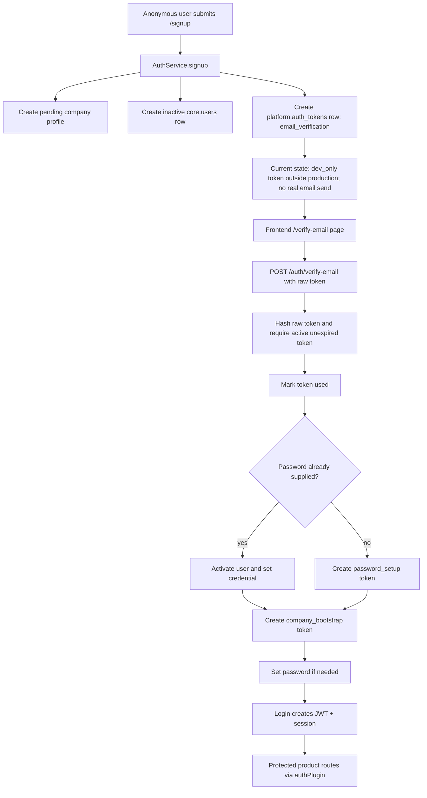
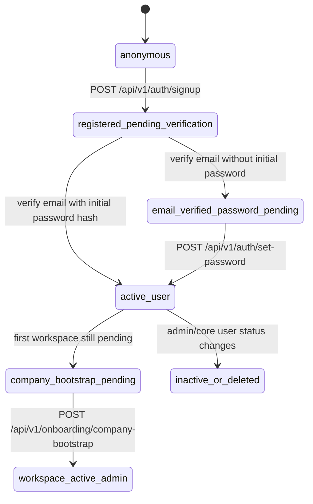
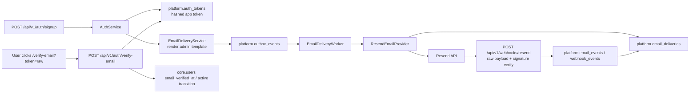

# Resend Email Verification Architecture Report

> Status note, 2026-05-25: this file is the original architecture and gap-analysis report that guided the implementation. The current implemented architecture is documented in `docs/architecture/email-verification.md`, and staging/production operations are documented in `docs/runbooks/resend-email-verification-deployment.md`. Older sections below that say Resend or delivery tables were "not found" describe the pre-implementation state at the time of the audit.

## 1. Executive Summary

- Current architecture summary: Hawkaii HRMS is a full-stack repository with separate apps: a Fastify 5 backend in `hrms_backend` and a TanStack Start/React frontend in `hrms-client`. Evidence: `hrms_backend/package.json` defines `hawkaii-hrms-backend` as a standalone Fastify backend with Node `>=22` and PNPM (`hrms_backend/package.json:2`, `hrms_backend/package.json:5`, `hrms_backend/package.json:7`, `hrms_backend/package.json:8`), and `hrms-client/package.json` defines `hawkaii-hrms-client` with TanStack Router/Start, React Query, Vite, and Playwright (`hrms-client/package.json:2`, `hrms-client/package.json:51`, `hrms-client/package.json:53`, `hrms-client/package.json:54`, `hrms-client/package.json:79`).
- Current auth summary: the backend uses custom auth with scrypt password hashes, custom HMAC-SHA256 JWTs, HTTP-only session cookies, bearer token support, and Valkey-backed session storage. Evidence: `hashPasswordSync`, `verifyPasswordSync`, `createJwt`, `verifyJwt`, `ValkeySessionStore`, and `authPlugin` in `hrms_backend/src/auth/index.ts:37`, `hrms_backend/src/auth/index.ts:42`, `hrms_backend/src/auth/index.ts:181`, `hrms_backend/src/auth/index.ts:206`, `hrms_backend/src/auth/index.ts:84`, and `hrms_backend/src/plugins/auth.ts:8`.
- Current email verification summary: signup already creates a cryptographically random raw token, stores only `sha256` token hash in `platform.auth_tokens`, and validates it as single-use with expiry. Evidence: `AuthService.signup`, `AuthService.createToken`, `AuthService.requireActiveToken`, and `tokenHash` in `hrms_backend/src/modules/auth/service.ts:90`, `hrms_backend/src/modules/auth/service.ts:468`, `hrms_backend/src/modules/auth/service.ts:495`, and `hrms_backend/src/modules/auth/service.ts:663`; table exists in `hrms_backend/src/db/migrations/0002_auth_onboarding.sql:17`.
- Main gap: no real email provider is wired. The codebase has admin email templates and notification channel settings, but no Resend, SMTP, SendGrid, Mailgun, Postmark, Nodemailer, webhook route, delivery table, or email sender function. Evidence: no provider dependency in `hrms_backend/package.json:98`, no Resend env names in `configSchema` (`hrms_backend/src/plugins/config.ts:4`), and code search found only docs/openapi text plus `AuthService.resendEmailVerification`; no send adapter.
- Recommended architecture: use a generic notification/email delivery architecture backed by the existing outbox/Valkey pattern and a Resend adapter. This fits the current repo better than direct sends because the repo already has `platform.admin_email_templates`, `platform.admin_notification_channels`, and `OutboxWorker`. Evidence: default verify/reset templates in `buildDefaultAdminEmailTemplates` (`hrms_backend/src/platform/data-store.ts:837`), channel settings in `buildDefaultAdminNotificationChannels` (`hrms_backend/src/platform/data-store.ts:915`), and outbox publishing in `OutboxWorker.publishPending` (`hrms_backend/src/workers/outbox-worker.ts:68`).
- Why this architecture is best for this repo: Resend official docs support Node SDK sends, idempotency keys, signed webhooks, event tracking, and recommend queueing/reducing concurrency for rate limits. Official references checked: [Resend Send Email](https://resend.com/docs/api-reference/emails/send-email), [Resend Idempotency Keys](https://resend.com/docs/dashboard/emails/idempotency-keys), [Resend Usage Limits](https://resend.com/docs/api-reference/rate-limit), [Resend Webhook Verification](https://resend.com/docs/webhooks/verify-webhooks-requests), [Resend Event Types](https://resend.com/docs/webhooks/event-types), [Resend Retries and Replays](https://resend.com/docs/webhooks/retries-and-replays), [Resend Domains](https://resend.com/docs/dashboard/domains/introduction), [OWASP Authentication Cheat Sheet](https://cheatsheetseries.owasp.org/cheatsheets/Authentication_Cheat_Sheet.html), [OWASP Forgot Password Cheat Sheet](https://cheatsheetseries.owasp.org/cheatsheets/Forgot_Password_Cheat_Sheet.html), [Fastify Hooks](https://fastify.dev/docs/v5.4.x/Reference/Hooks/), and [Fastify Content Type Parser](https://fastify.dev/docs/latest/Reference/ContentTypeParser/).

## 2. Current Tech Stack

| Area | Current state | Evidence |
|---|---|---|
| Backend framework | Fastify 5 | `fastify` dependency in `hrms_backend/package.json:106`; `buildApp` creates Fastify instance in `hrms_backend/src/app.ts:51` |
| Backend language/runtime | TypeScript, ESM, Node >=22 | `type: module` and engines in `hrms_backend/package.json:6`, `hrms_backend/package.json:8` |
| Frontend framework | TanStack Start, TanStack Router, React 19, Vite | `hrms-client/package.json:53`, `hrms-client/package.json:54`, `hrms-client/package.json:63`, `hrms-client/package.json:93` |
| Package manager | PNPM | `packageManager` in `hrms_backend/package.json:7` and `hrms-client/package.json:6` |
| Database | PostgreSQL | `pg` dependency in `hrms_backend/package.json:109`; runtime store requires `DATABASE_URL` unless memory explicitly enabled in `hrms_backend/src/app.ts:127` |
| ORM/query layer | Raw SQL migrations and PostgreSQL persistence, with Drizzle table metadata | migrations under `hrms_backend/src/db/migrations`; Drizzle schema in `hrms_backend/src/db/schema.ts:16`; `pg` pool usage in `hrms_backend/src/platform/postgres-data-store.ts` |
| Auth method | Custom auth: scrypt password hash, custom HS256 JWT, Valkey session records, cookie/bearer token | `hrms_backend/src/auth/index.ts:37`, `hrms_backend/src/auth/index.ts:181`, `hrms_backend/src/auth/index.ts:84`; cookie set in `hrms_backend/src/modules/auth/routes.ts:52` |
| Validation | Zod | `zod` dependency in `hrms_backend/package.json:111`; auth schemas in `hrms_backend/src/modules/auth/schemas.ts:1` |
| Password hashing | Node `scryptSync` | `hashPasswordSync` in `hrms_backend/src/auth/index.ts:37` |
| Email provider | Not found in current codebase | No provider dependency in `hrms_backend/package.json:98`; no Resend/SMTP env in `hrms_backend/src/plugins/config.ts:4` |
| Email templates | Admin-managed templates exist, but no delivery adapter | `buildDefaultAdminEmailTemplates` in `hrms_backend/src/platform/data-store.ts:837`; admin template routes in `hrms_backend/src/modules/admin/routes.ts:180` |
| Queue/background jobs | Outbox worker publishes events to Valkey Streams | `worker:outbox` script in `hrms_backend/package.json:43`; `OutboxWorker` in `hrms_backend/src/workers/outbox-worker.ts:58` |
| Logging | Pino via Fastify logger options | `pino` dependency in `hrms_backend/package.json:110`; `loggerOptions` used in `hrms_backend/src/app.ts:52` |
| Rate/security | Custom rate-limit plugin, CORS, custom security headers, cookies | `rateLimitPlugin` in `hrms_backend/src/plugins/rate-limit.ts:19`; CORS in `hrms_backend/src/app.ts:83`; `securityHeadersPlugin` in `hrms_backend/src/plugins/security-headers.ts`; cookies in `hrms_backend/src/app.ts:86` |
| Testing | Vitest backend, Playwright frontend | backend scripts in `hrms_backend/package.json:47`; frontend Playwright scripts in `hrms-client/package.json:14` |

## 3. Current Folder Architecture

| Folder/file | Purpose | Evidence |
|---|---|---|
| `hrms_backend/src/app.ts` | Fastify app composition, plugins, Swagger/OpenAPI, module registration | `buildApp` registers plugins and modules in `hrms_backend/src/app.ts:51`, `hrms_backend/src/app.ts:80`, `hrms_backend/src/app.ts:100`, `hrms_backend/src/app.ts:104` |
| `hrms_backend/src/server.ts` | Runtime server entrypoint | Not re-read for this report; previously inspected in codebase. Current app entrypoint is `buildApp`. |
| `hrms_backend/src/auth/index.ts` | Low-level password, JWT, session, role/permission helpers | `hashPasswordSync`, `createJwt`, `ValkeySessionStore`, `hasRole` in `hrms_backend/src/auth/index.ts:37`, `hrms_backend/src/auth/index.ts:181`, `hrms_backend/src/auth/index.ts:84`, `hrms_backend/src/auth/index.ts:249` |
| `hrms_backend/src/modules/auth` | Auth/onboarding routes, schemas, repository, service | routes in `hrms_backend/src/modules/auth/routes.ts:17`; schemas in `hrms_backend/src/modules/auth/schemas.ts:3`; service class in `hrms_backend/src/modules/auth/service.ts:66` |
| `hrms_backend/src/modules/*` | Feature modules registered by Fastify plugin | module imports and registration in `hrms_backend/src/app.ts:19` and `hrms_backend/src/app.ts:104` |
| `hrms_backend/src/plugins` | Config, auth guard, rate-limit, CORS-related app plugins, errors, cookies, headers | `configPlugin` in `hrms_backend/src/plugins/config.ts:42`; `authPlugin` in `hrms_backend/src/plugins/auth.ts:5`; `rateLimitPlugin` in `hrms_backend/src/plugins/rate-limit.ts:19` |
| `hrms_backend/src/db/migrations` | SQL migrations | migration files `0001_initial.sql` through `0019_asset_vendor_recovery_workflows.sql` |
| `hrms_backend/src/db/schema.ts` | Drizzle schema/table metadata | schemas declared in `hrms_backend/src/db/schema.ts:16` |
| `hrms_backend/src/platform` | In-memory data model, PostgreSQL persistence, OpenAPI helpers, errors | data-store records/templates in `hrms_backend/src/platform/data-store.ts`; OpenAPI registry in `hrms_backend/src/platform/openapi.ts`; central errors in `hrms_backend/src/platform/errors.ts` |
| `hrms_backend/src/workers` | Outbox worker | `OutboxWorker` in `hrms_backend/src/workers/outbox-worker.ts:58` |
| `hrms-client/src/routes` | TanStack Router route files | auth routes: `signup.tsx`, `verify-email.tsx`, `login.tsx`, `set-password.tsx`, `_app.tsx` |
| `hrms-client/src/lib/auth.tsx` | Frontend auth provider and UI flow orchestration | `AuthProvider` in `hrms-client/src/lib/auth.tsx:253` |
| `hrms-client/src/domains/auth/api.ts` | Frontend backend API adapter for auth | `authApi` in `hrms-client/src/domains/auth/api.ts:157` |
| `hrms-client/src/shared/api` | API base URL, fetch wrapper, mock fallback policy | config in `hrms-client/src/shared/api/config.ts:21`; request wrapper in `hrms-client/src/shared/api/client.ts:34` |

## 4. Current Authentication Flow

### Registration / workspace signup

- Route: `POST /api/v1/auth/signup`.
- Handler: anonymous handler in `authRoutes`, validates with `signupSchema`, calls `AuthService.signup` (`hrms_backend/src/modules/auth/routes.ts:18`, `hrms_backend/src/modules/auth/schemas.ts:36`, `hrms_backend/src/modules/auth/service.ts:90`).
- Current behavior:
  - Normalizes email and company slug (`AuthService.signup`, `hrms_backend/src/modules/auth/service.ts:90`).
  - Creates or updates a pending user and company profile (`createPendingUser`, `createCompanyProfile`, `hrms_backend/src/modules/auth/service.ts:102`, `hrms_backend/src/modules/auth/service.ts:420`, `hrms_backend/src/modules/auth/service.ts:443`).
  - Sets new signup users to `EmploymentStatuses.Inactive` (`hrms_backend/src/modules/auth/service.ts:430`).
  - Revokes active `email_verification` tokens for the user and creates a new one with 24-hour TTL (`hrms_backend/src/modules/auth/service.ts:116`, `hrms_backend/src/modules/auth/service.ts:120`).
  - Stores only token hash via `createToken` and `tokenHash`; raw token is returned only under `dev_only` outside production (`hrms_backend/src/modules/auth/service.ts:140`, `hrms_backend/src/modules/auth/service.ts:468`, `hrms_backend/src/modules/auth/service.ts:677`).
- Missing: real email send is not implemented. The frontend navigates to `/verify-email?email=...&state=sent` (`hrms-client/src/routes/signup.tsx:56`) and says a verification link was sent (`hrms-client/src/routes/verify-email.tsx:111`), but no backend delivery provider exists.

### Login

- Route: `POST /api/v1/auth/login`.
- Handler: `authRoutes` validates `loginSchema`, calls `AuthService.login`, sets cookie, and returns `access_token` (`hrms_backend/src/modules/auth/routes.ts:48`, `hrms_backend/src/modules/auth/schemas.ts:3`, `hrms_backend/src/modules/auth/routes.ts:52`).
- Password auth: `AuthService.authenticatePassword` requires a user, active employment status, active credential, and valid scrypt password (`hrms_backend/src/modules/auth/service.ts:397`).
- Session/JWT: `AuthService.login` creates JWT and session store record (`hrms_backend/src/modules/auth/service.ts:76`; `createJwt` in `hrms_backend/src/auth/index.ts:181`).
- Cookies: auth route sets `SESSION_COOKIE_NAME` cookie with `httpOnly`, `sameSite: "lax"`, `secure: COOKIE_SECURE`, path `/`, and expiry (`hrms_backend/src/modules/auth/routes.ts:52`).
- Frontend: `AuthProvider.login` calls `authApi.login`, stores access token, and calls `/me` (`hrms-client/src/lib/auth.tsx:355`, `hrms-client/src/domains/auth/api.ts:158`).

### Logout

- Route: `POST /api/v1/auth/logout`.
- Handler: reads cookie token, verifies JWT, revokes session by `jti`, clears cookie (`hrms_backend/src/modules/auth/routes.ts:66`).
- Logout route is public in `authPlugin` allowlist (`hrms_backend/src/plugins/auth.ts:21`), but only revokes if the cookie is present and valid.

### Email verification

- Route: `POST /api/v1/auth/verify-email`.
- Handler: validates `verifyEmailSchema`, calls `AuthService.verifyEmail` (`hrms_backend/src/modules/auth/routes.ts:23`, `hrms_backend/src/modules/auth/schemas.ts:49`, `hrms_backend/src/modules/auth/service.ts:144`).
- Current behavior:
  - Hashes raw token and finds active `platform.auth_tokens` record by token type.
  - Rejects missing, used, revoked, or expired token (`requireActiveToken`, `hrms_backend/src/modules/auth/service.ts:495`).
  - Marks token as used (`hrms_backend/src/modules/auth/service.ts:150`).
  - If password was provided during signup, activates user and stores credential (`hrms_backend/src/modules/auth/service.ts:153`).
  - Otherwise creates a `password_setup` token and leaves user inactive until password setup (`hrms_backend/src/modules/auth/service.ts:158`).
  - Creates a `company_bootstrap` token for first workspace bootstrap (`hrms_backend/src/modules/auth/service.ts:172`).
- Current verification state is inferred from `employment_status` and token usage. There is no `email_verified_at` or `email_verification_status` field in `core.users` (`hrms_backend/src/db/schema.ts:73`).

### Resend verification request

- Route: `POST /api/v1/auth/email-verifications/resend`.
- Handler: validates `resendEmailVerificationSchema`, calls `AuthService.resendEmailVerification` (`hrms_backend/src/modules/auth/routes.ts:28`, `hrms_backend/src/modules/auth/schemas.ts:54`, `hrms_backend/src/modules/auth/service.ts:195`).
- Current behavior:
  - Public/enumeration-safe shape: always returns `accepted: true` and retry guidance.
  - Generates a new verification token only if a pending/inactive user is found.
  - Does not send email.

### Forgot/reset password

- Routes: `POST /api/v1/auth/password-reset/request` and `POST /api/v1/auth/password-reset/confirm`.
- Handler functions: `AuthService.requestPasswordReset` and `AuthService.confirmPasswordReset` (`hrms_backend/src/modules/auth/routes.ts:38`, `hrms_backend/src/modules/auth/service.ts:238`, `hrms_backend/src/modules/auth/service.ts:261`).
- Current behavior:
  - Request is enumeration-safe and returns `accepted`.
  - Token uses same `platform.auth_tokens` table, hashed storage, expiry, and single-use semantics.
  - Reset revokes existing sessions via `sessionStore.revokeUser` (`hrms_backend/src/modules/auth/service.ts:272`).

### Protected routes and auth middleware

- Global auth middleware: `authPlugin` runs in `preHandler` (`hrms_backend/src/plugins/auth.ts:8`).
- Public paths: health, signup, verify email, resend verification, set password, password reset, login, logout, company bootstrap, OpenAPI JSON, docs, and asset scan (`hrms_backend/src/plugins/auth.ts:9`).
- Protected route behavior:
  - Reads session cookie or `Authorization: Bearer` token (`hrms_backend/src/plugins/auth.ts:36`).
  - Verifies JWT (`hrms_backend/src/plugins/auth.ts:44`).
  - Verifies session record is not revoked (`hrms_backend/src/plugins/auth.ts:45`).
  - Loads actor from `store.users` and attaches `request.actor` (`hrms_backend/src/plugins/auth.ts:49`).
- Frontend protected layout: `_app` route redirects to `/login` when `user` is missing (`hrms-client/src/routes/_app.tsx:17`).

### Auth flow diagram

## 5. Current User Business Lifecycle

### Current states found

| State | Current evidence | Notes |
|---|---|---|
| Anonymous | Public auth routes in `authPlugin` allow signup/login/reset/verify | `hrms_backend/src/plugins/auth.ts:9` |
| Pending workspace/company | `createCompanyProfile` creates status `pending` and `bootstrap_completed_at: null` | `hrms_backend/src/modules/auth/service.ts:443`; DB table in `hrms_backend/src/db/migrations/0002_auth_onboarding.sql:1` |
| Inactive pending user | `createPendingUser` uses `EmploymentStatuses.Inactive` | `hrms_backend/src/modules/auth/service.ts:420`, `hrms_backend/src/modules/auth/service.ts:430` |
| Email verification token active | `AuthService.signup` creates `email_verification` token | `hrms_backend/src/modules/auth/service.ts:120` |
| Email verified, password pending | If signup had no password, `verifyEmail` creates `password_setup` token and leaves user inactive | `hrms_backend/src/modules/auth/service.ts:158` |
| Active user | `verifyEmail` with embedded password hash or `setPassword` sets `employment_status` active | `hrms_backend/src/modules/auth/service.ts:156`, `hrms_backend/src/modules/auth/service.ts:226` |
| Company bootstrap pending | `verifyEmail` creates `company_bootstrap` token | `hrms_backend/src/modules/auth/service.ts:172` |
| Workspace active/admin | `bootstrapCompany` sets company status active and adds Admin role | `hrms_backend/src/modules/auth/service.ts:295`, `hrms_backend/src/modules/auth/service.ts:300` |
| Suspended/deleted/etc. | Deleted users are represented by `deleted_at`; non-active employment statuses appear in logic. Specific suspended/blocked enum was not found in current inspected code. | `core.users.deletedAt` in `hrms_backend/src/db/schema.ts:90`; login checks `employment_status !== "active"` in `hrms_backend/src/modules/auth/service.ts:402` |

### Current lifecycle state machine

### Business lifecycle findings

- `core.users` has no `emailVerifiedAt`, `email_verified_at`, `isVerified`, or `emailVerificationStatus` field in the inspected schema (`hrms_backend/src/db/schema.ts:73`).
- Unverified users cannot normally log in because pending signup users are inactive and `authenticatePassword` rejects non-active accounts (`hrms_backend/src/modules/auth/service.ts:402`).
- Business routes are globally protected by `authPlugin`, but the guard currently checks only session validity and actor existence. It does not check an explicit verified-email field because that field does not exist (`hrms_backend/src/plugins/auth.ts:44`).
- Paid plans, subscriptions, credits, API keys, and billing were not found in current codebase during this audit.
- Invitations exist as an input surface (`invite_token` in `signupSchema`, `hrms_backend/src/modules/auth/schemas.ts:45`) and admin templates include an `invite` template (`hrms_backend/src/platform/data-store.ts:845`), but an invite delivery provider is not found in current codebase.
- Organization/workspace control exists through `platform.company_profiles` and session preferences (`hrms_backend/src/db/migrations/0002_auth_onboarding.sql:1`, `hrms_backend/src/db/migrations/0002_auth_onboarding.sql:36`).
- Role-based access control exists through roles, permissions, user roles, `rolePermissions`, and per-module assertions (`hrms_backend/src/db/schema.ts:103`, `hrms_backend/src/db/schema.ts:116`, `hrms_backend/src/db/schema.ts:133`, `hrms_backend/src/auth/index.ts:227`).

## 6. Current Database Models

| Model/table | Current fields/behavior | Evidence |
|---|---|---|
| `core.users` | `id`, `employee_code`, `email`, `full_name`, department/designation/manager IDs, `hierarchy_path`, `employment_status`, timezone, joined/terminated dates, timestamps, `deleted_at`, `version`. No email verification column. | Drizzle metadata in `hrms_backend/src/db/schema.ts:73`; SQL table in `hrms_backend/src/db/migrations/0001_initial.sql` |
| `platform.company_profiles` | Workspace profile with `company_slug`, `status`, and `bootstrap_completed_at`. | `hrms_backend/src/db/migrations/0002_auth_onboarding.sql:1` |
| `platform.auth_tokens` | Generic auth token table for `email_verification`, `password_setup`, `password_reset`, and `company_bootstrap`; stores `token_hash`, type, user/email/company, status, expiry, `used_at`, `created_at`, `metadata`. | `hrms_backend/src/db/migrations/0002_auth_onboarding.sql:17`; `AuthTokenRecord` in `hrms_backend/src/platform/data-store.ts:163` |
| `platform.user_credentials` | Password hashes and active/deleted credential status. | `UserCredentialRecord` in `hrms_backend/src/platform/data-store.ts:153`; credential persistence in `AuthService.setCredential`, `hrms_backend/src/modules/auth/service.ts:524` |
| `platform.user_sessions` | Session records by `jti`, user, expiry, revoked timestamp. | `SessionRecord` in `hrms_backend/src/auth/index.ts:6`; session table metadata in `hrms_backend/src/db/schema.ts:149` |
| `platform.user_session_preferences` | Active role/company/landing page/locale/timezone. | `hrms_backend/src/db/migrations/0002_auth_onboarding.sql:36`; `AuthService.sessionContext`, `hrms_backend/src/modules/auth/service.ts:339` |
| `platform.outbox_events` | Outbox events with event id, aggregate, payload, idempotency key, status, retry counts, timestamps. | `hrms_backend/src/db/schema.ts:205`; worker in `hrms_backend/src/workers/outbox-worker.ts:58` |
| `platform.notifications` | In-app notifications. | `hrms_backend/src/db/schema.ts:230` |
| `platform.admin_email_templates` | Template key/module/name/subject/body/locale/status/version. | `hrms_backend/src/platform/data-store.ts:837`; routes in `hrms_backend/src/modules/admin/routes.ts:180` |
| `platform.admin_notification_channels` | In-app/email/push toggles for event keys. | `hrms_backend/src/platform/data-store.ts:915`; routes in `hrms_backend/src/modules/admin/routes.ts:198` |
| `platform.processed_events` | Event dedup marker table exists in schema. | `hrms_backend/src/db/schema.ts:356` |
| Email delivery logs | Not found in current codebase. | No `email_deliveries`, `email_events`, or webhook route found. |
| Webhook events | Not found in current codebase as a webhook-specific table. | Only generic `processed_events` exists in `hrms_backend/src/db/schema.ts:356`. |

### Current transaction/indexing/naming style

- Database type: PostgreSQL.
- Query style: raw SQL migrations and PostgreSQL persistence, with Drizzle schema metadata.
- Migration naming: numbered SQL files such as `0001_initial.sql`, `0002_auth_onboarding.sql`, through `0019_asset_vendor_recovery_workflows.sql`.
- Naming: schemas are plural/domain-based (`core`, `platform`, `documents`, `projects`, etc.) and tables use snake_case.
- Foreign keys: the project has a `db:verify:no-cross-schema-fks` script (`hrms_backend/package.json:58`); recommended email schema should avoid cross-schema FK assumptions or match the current no-cross-schema-FK policy.
- Soft delete: several domain tables use `deleted_at`; `core.users` includes `deleted_at` (`hrms_backend/src/db/schema.ts:90`).
- Timestamps/versioning: common `created_at`, `updated_at`, `deleted_at`, and `version` helpers are used in schema metadata (`hrms_backend/src/db/schema.ts:28`).

## 7. Current API Route Map

### Auth and onboarding routes

| Method | Path | File path | Handler/service | Public/protected | Validation | Purpose |
|---|---|---|---|---|---|---|
| POST | `/api/v1/auth/signup` | `hrms_backend/src/modules/auth/routes.ts:18` | `AuthService.signup` | Public via `authPlugin` | `signupSchema` | Create pending workspace user and email verification token |
| POST | `/api/v1/auth/verify-email` | `hrms_backend/src/modules/auth/routes.ts:23` | `AuthService.verifyEmail` | Public via `authPlugin` | `verifyEmailSchema` | Verify app-owned token and transition account to password/bootstrap step |
| POST | `/api/v1/auth/email-verifications/resend` | `hrms_backend/src/modules/auth/routes.ts:28` | `AuthService.resendEmailVerification` | Public via `authPlugin` | `resendEmailVerificationSchema` | Create new token for pending identity; no real email send yet |
| POST | `/api/v1/auth/set-password` | `hrms_backend/src/modules/auth/routes.ts:33` | `AuthService.setPassword` | Public via `authPlugin` | `setPasswordSchema` | Consume password setup token and activate user credential |
| POST | `/api/v1/auth/password-reset/request` | `hrms_backend/src/modules/auth/routes.ts:38` | `AuthService.requestPasswordReset` | Public via `authPlugin` | `passwordResetRequestSchema` | Enumeration-safe password reset token request |
| POST | `/api/v1/auth/password-reset/confirm` | `hrms_backend/src/modules/auth/routes.ts:43` | `AuthService.confirmPasswordReset` | Public via `authPlugin` | `passwordResetConfirmSchema` | Consume password reset token and revoke sessions |
| POST | `/api/v1/auth/login` | `hrms_backend/src/modules/auth/routes.ts:48` | `AuthService.login` | Public via `authPlugin` | `loginSchema` | Authenticate and create JWT/session |
| POST | `/api/v1/auth/logout` | `hrms_backend/src/modules/auth/routes.ts:66` | `AuthService.logout` | Public via `authPlugin` but token-aware | JWT verification if cookie present | Revoke current session and clear cookie |
| GET | `/api/v1/auth/me` | `hrms_backend/src/modules/auth/routes.ts:86` | `AuthService.sessionContext` | Protected | `request.actor` | Return current user/session/roles/company context |
| PATCH | `/api/v1/auth/session/preference` | `hrms_backend/src/modules/auth/routes.ts:93` | `AuthService.updateSessionPreference` | Protected | `sessionPreferenceSchema` | Update active role/company/session preference |
| POST | `/api/v1/onboarding/company-bootstrap` | `hrms_backend/src/modules/auth/routes.ts:103` | `AuthService.bootstrapCompany` | Public token-based via `authPlugin` | `companyBootstrapSchema` | Activate pending company and promote first admin |

### Route group inventory for protected business APIs

All routes below are protected by `authPlugin` unless the path is explicitly listed in the public allowlist in `hrms_backend/src/plugins/auth.ts:9`. Exact request/response schema registration is centralized in `hrms_backend/src/platform/openapi.ts`.

| Module | Prefix | File path | Route inventory |
|---|---|---|---|
| Health | no prefix and `/api/v1` | `hrms_backend/src/modules/health/routes.ts:17` | `/health/live`, `/health/ready`, `/api/v1/health/live`, `/api/v1/health/ready`; public |
| Core users | `/api/v1/core` | `hrms_backend/src/modules/core/index.ts:5`, `hrms_backend/src/modules/core/routes.ts:110` | org selectors; users list/create/detail/update/activate/deactivate/login enable-disable/roles/history/audit/import/export/subtree |
| Dashboard | `/api/v1/dashboard` | `hrms_backend/src/app.ts:107`, `hrms_backend/src/modules/dashboard/routes.ts:6` | summary |
| Documents | `/api/v1` | `hrms_backend/src/modules/documents/index.ts:5`, `hrms_backend/src/modules/documents/routes.ts:14` | document upload/list/detail/download-url/verify/access-log; expense document upload |
| Expenses | `/api/v1` | `hrms_backend/src/modules/expenses/routes.ts:90` | create/my/metadata/dashboard/detail/submit/withdraw/clarification/manager queue/finance queue/payment/settlement/timeline/audit/manager backups |
| Assets | `/api/v1/assets` | `hrms_backend/src/modules/assets/routes.ts:80` | inventory, warranty alerts, detail, assign/return, public scan, licenses, requests, acknowledgements, maintenance, vendors, recovery queue |
| Attendance | `/api/v1/attendance` | `hrms_backend/src/modules/attendance/routes.ts:33` | punches, my/team summaries, calendars, regularizations, exceptions, exports |
| Leave/WFH/Holidays | `/api/v1` | `hrms_backend/src/modules/leave-wfh/routes.ts:35` | leave balances/requests/queue/decision/cancel; WFH requests/queue/decision; HR monitor; exports; holidays |
| EMS | `/api/v1` | `hrms_backend/src/modules/ems/routes.ts:37` | profile, change requests, HR requests, onboarding, probation, exits, letters, policies, employee documents |
| Projects/utilization | `/api/v1` | `hrms_backend/src/modules/projects/routes.ts:36` | projects CRUD/archive, members, allocations, milestones, documents, summary, team-utilization summary |
| Helpdesk | `/api/v1` | `hrms_backend/src/modules/helpdesk/routes.ts:96` | tickets CRUD/comments/internal notes/attachments/assign/priority/status/resolve/close/reopen, categories, SLA report |
| Notifications | `/api/v1` | `hrms_backend/src/modules/notifications/routes.ts:24` | list, unread count, mark read, read all |
| Reports | `/api/v1/reports` | `hrms_backend/src/modules/reports/routes.ts:50` | expense reports, HR, attendance, leave/WFH, projects, timesheets, assets, helpdesk, audit, exports |
| Admin settings | `/api/v1/admin` | `hrms_backend/src/modules/admin/index.ts:5`, `hrms_backend/src/modules/admin/routes.ts:35` | company profile, master data, RBAC, workflows, policies, email templates, notification channels, audit log, security settings |
| Platform | `/api/v1/platform` | `hrms_backend/src/modules/platform/routes.ts:7` | finance governance |
| Timesheets | `/api/v1/timesheets` | `hrms_backend/src/modules/timesheets/routes.ts:57` | work segments, submissions, queues, project summaries, missing submissions, productivity, selectors, workflows |

## 8. Current Frontend/Auth UI Flow

| UI route/component | Current behavior | Evidence |
|---|---|---|
| `/signup` | Collects first/middle/last name, email, company name, contact, terms; calls `signup`; navigates to `/verify-email` without token. | `hrms-client/src/routes/signup.tsx:39`, `hrms-client/src/routes/signup.tsx:56` |
| `/verify-email` | Accepts optional `email`, `token`, `state`; if token exists, calls `verifyToken`; supports resend button. | `hrms-client/src/routes/verify-email.tsx:14`, `hrms-client/src/routes/verify-email.tsx:36`, `hrms-client/src/routes/verify-email.tsx:82` |
| `/set-password` | Existing page is used after `password_setup` token. | `AuthProvider.setPasswordForToken` in `hrms-client/src/lib/auth.tsx:642`; route file exists in `hrms-client/src/routes/set-password.tsx` |
| `/login` | Calls `AuthProvider.login`; then dashboard/onboarding redirect logic. | `AuthProvider.login` in `hrms-client/src/lib/auth.tsx:355`; API adapter in `hrms-client/src/domains/auth/api.ts:158` |
| `/onboarding` | Calls `completeCompanySetup` using session-stored bootstrap token. | `AuthProvider.completeCompanySetup` in `hrms-client/src/lib/auth.tsx:696` |
| App shell `_app` | Redirects to `/login` when no frontend user state exists. | `hrms-client/src/routes/_app.tsx:17` |
| API client | Uses `fetch`, credentials include, bearer token, JSON body, rate-limit handling. | `hrms-client/src/shared/api/client.ts:34`, `hrms-client/src/shared/api/client.ts:48`, `hrms-client/src/shared/api/client.ts:57` |
| Mock fallback | Disabled in production mode, controlled by `VITE_API_MOCK_FALLBACK` otherwise. | `hrms-client/src/shared/api/config.ts:21`, `hrms-client/src/shared/api/config.ts:27` |

### UI changes needed for real email verification

- Existing `/verify-email` page can remain the primary check-inbox and token callback page.
- Backend must construct links to the existing frontend route: `${FRONTEND_URL}/verify-email?token=...&email=...`.
- When production `dev_only` tokens are absent, the frontend should not depend on `rec.token`; current signup already navigates without token (`hrms-client/src/routes/signup.tsx:57`).
- Resend success/failure should not expose whether the email exists. UI copy should stay generic: "If the email exists and needs verification, we will send a link."
- If the backend later allows unverified authenticated sessions, the frontend needs a verification-pending guard; current model avoids that because unverified users cannot log in.

## 9. Current Email/Notification System

| Item | Current status | Evidence |
|---|---|---|
| Resend provider | Not found in current codebase | No `resend` dependency in `hrms_backend/package.json:98`; no `RESEND_*` config in `hrms_backend/src/plugins/config.ts:4` |
| SMTP/Nodemailer/SendGrid/Mailgun/Postmark/Brevo/Mailtrap provider | Not found in current codebase | Search found no production provider imports or env config. |
| Email templates | Present | `buildDefaultAdminEmailTemplates` includes `invite`, `verify`, and `reset` templates in `hrms_backend/src/platform/data-store.ts:837` |
| Email template admin routes | Present | `GET /api/v1/admin/email-templates` and `PUT /api/v1/admin/email-templates/:template_key` in `hrms_backend/src/modules/admin/routes.ts:180` |
| Notification channel toggles | Present | `buildDefaultAdminNotificationChannels` in `hrms_backend/src/platform/data-store.ts:915`; routes in `hrms_backend/src/modules/admin/routes.ts:198` |
| Send-email function | Not found in current codebase | No provider adapter/function found; `AuthService.signup` only returns dev token (`hrms_backend/src/modules/auth/service.ts:140`) |
| Webhook handling | Not found in current codebase | No `/webhooks/resend` or webhook module found. |
| Email logs | Not found in current codebase | No `email_deliveries` or `email_events` table found. |
| Retry logic | Partially present as generic outbox retry/publish logic | `OutboxWorker` retries and dead-letters outbox events (`hrms_backend/src/workers/outbox-worker.ts:92`) |
| Queue/background system | Present as outbox-to-Valkey stream publisher, not as email worker | `ValkeyStreamPublisher` in `hrms_backend/src/workers/outbox-worker.ts:18` |

Recommendation: Resend should be wrapped behind a generic email provider adapter and integrated through a notification/email delivery service. It should not replace an existing provider because no existing provider was found.

## 10. Security Gap Analysis

| Security Item | Status | Evidence | Recommendation |
|---|---|---|---|
| Secure random token generation | Present | `randomBytes(32).toString("base64url")` in `AuthService.createToken`, `hrms_backend/src/modules/auth/service.ts:476` | Keep. |
| Token hashing before DB storage | Present | `token_hash: tokenHash(raw)` in `hrms_backend/src/modules/auth/service.ts:480`; SHA-256 in `tokenHash`, `hrms_backend/src/modules/auth/service.ts:663` | Keep. Consider HMAC with server secret for defense-in-depth if token table leaks. |
| Token expiry | Present | `expires_at` in `createToken`, `hrms_backend/src/modules/auth/service.ts:486`; expiry check in `requireActiveToken`, `hrms_backend/src/modules/auth/service.ts:503` | Keep. |
| Single-use token logic | Present | Token marked `used` in `verifyEmail`, `setPassword`, and `confirmPasswordReset` (`hrms_backend/src/modules/auth/service.ts:151`, `hrms_backend/src/modules/auth/service.ts:228`, `hrms_backend/src/modules/auth/service.ts:270`) | Keep. |
| Token revocation | Present | `revokeActiveTokensForUser` sets status revoked (`hrms_backend/src/modules/auth/service.ts:518`) | Add `revoked_at` timestamp for auditability. |
| Rate limiting by IP | Present | unauthenticated subject uses `ip:${request.ip}` in `rateLimitPlugin`, `hrms_backend/src/plugins/rate-limit.ts:52` | Keep; tune auth/email limits separately. |
| Rate limiting by email/user | Partially present | Auth route limit is route/IP or actor based (`hrms_backend/src/plugins/rate-limit.ts:52`); no per-email resend counter found. | Add per-normalized-email cooldown/daily limit for signup, resend, verify, password reset. |
| Cooldown for resend verification | Missing/partial | Response returns `retry_after_seconds: 60`, but no per-email cooldown enforcement found in `AuthService.resendEmailVerification`, `hrms_backend/src/modules/auth/service.ts:195` | Enforce 60-second cooldown, hourly/daily caps. |
| Non-enumerating public responses | Partially present | `requestPasswordReset` and `resendEmailVerification` return accepted for unknown emails (`hrms_backend/src/modules/auth/service.ts:195`, `hrms_backend/src/modules/auth/service.ts:238`); signup exposes conflict for existing verified email (`hrms_backend/src/modules/auth/service.ts:97`) | Keep non-enumeration for resend/reset. Consider generic signup duplicate response if public abuse risk is high. |
| Audit logs | Partially present | Admin updates append outbox events in admin service; auth signup/verify email delivery events not found. | Add auth/email audit events and delivery records. |
| Email event logs | Missing | No table/service found. | Add `platform.email_deliveries`, `platform.email_events`, and `platform.webhook_events`. |
| Webhook signature verification | Missing | No webhook route found. Resend docs require raw payload and signed headers. | Add raw-body webhook route using `resend.webhooks.verify` or Svix. |
| Raw request body handling for webhooks | Missing | No Fastify parser/plugin found for webhook raw body. | Use a route-scoped custom parser or raw-body plugin; Fastify docs support `addContentTypeParser` with `parseAs: "string"`. |
| Webhook deduplication | Partially present | Generic `processed_events` table exists (`hrms_backend/src/db/schema.ts:356`), but no Resend webhook use. | Add unique provider event id table and idempotent processing. |
| CSRF protection for cookie auth | Partially present/unknown | Cookie has SameSite Lax (`hrms_backend/src/modules/auth/routes.ts:54`); no explicit CSRF token middleware found. | For state-changing cookie-auth endpoints, consider CSRF token or require bearer header for browser API writes. |
| CORS config | Present | CORS registered in `buildApp` (`hrms_backend/src/app.ts:83`); production origin guard in app config logic. | Keep strict `CORS_ALLOWED_ORIGINS` in production. |
| Helmet/security headers | Partially present | Custom security headers plugin exists and is registered (`hrms_backend/src/app.ts:82`) | Consider CSP for frontend separately. |
| Input validation | Present | Zod schemas in `hrms_backend/src/modules/auth/schemas.ts:1` | Keep and extend for webhook payload type checks after signature verification. |
| Centralized error handling | Present | `errorsPlugin` registered in `hrms_backend/src/app.ts:81` | Keep. |
| Logging/monitoring | Partially present | Pino and request IDs exist; email delivery monitoring not found. | Add delivery status metrics/log fields without token values. |
| Account lockout/brute-force protection | Partially present | Rate-limit plugin and admin security settings tests exist; persistent per-account lockout not found. | For email verification, prefer rate limits/cooldowns over lockout; for login, consider failed-attempt counters if needed. |

## 11. Architecture Options Compared

| Option | Fit for this repo | Complexity | Pros | Cons | Required files/DB | Recommended? |
|---|---|---|---|---|---|---|
| Option A: Simple direct-send, `Controller -> Verification Service -> Resend Adapter` | Technically easy but weak fit because repo already has outbox, templates, and notification settings | Low | Fast to implement; minimal moving parts | Request latency tied to Resend; weaker retries; no provider status logging unless added separately; bypasses admin notification architecture | Add `resend` dependency, config, adapter; modify `AuthService`; minimal DB log table | Not recommended except as a temporary local-only spike |
| Option B: Queue-based, `Controller -> Verification Service -> Email Job Queue -> Worker -> Resend Adapter` | Strong fit because `OutboxWorker` and Valkey Streams already exist | Medium | Better retry/backoff, respects Resend rate limits, avoids signup latency | Existing outbox only publishes events; a consumer/email worker must be added | Add email worker, delivery tables, Resend adapter, env vars | Recommended as delivery mechanism |
| Option C: Generic notification architecture, `AuthService -> Notification/EmailDelivery Service -> Email Provider Adapter -> Resend`, backed by outbox | Best fit because admin email templates and notification channels already exist | Medium-high | Reuses templates/channels; supports future leave/expense/helpdesk email without duplicating providers; delivery logs/webhooks fit centrally | More files than direct send; must avoid overbuilding marketing features | Add notification/email delivery service, Resend adapter, delivery/event tables, webhook route, worker | Recommended |
| Option D: Auth-provider-based architecture | Poor fit | High/change-heavy | Would outsource email verification if using provider | Repo uses custom auth, not NextAuth/Passport/Auth.js; would change architecture | Major auth rewrite | Not recommended |

Chosen architecture: Option C with Option B's outbox/worker mechanics.

## 12. Recommended Architecture

### Recommended design

Use a generic email delivery service that renders existing admin email templates and sends through a Resend provider adapter asynchronously.

Proposed flow:

1. `AuthService.signup`, `AuthService.resendEmailVerification`, `AuthService.requestPasswordReset`, and any employee invite/login-enable flow create an auth token exactly as they do today.
2. These auth methods call a new `EmailDeliveryService.enqueueTemplateEmail(...)` or append an outbox event such as `auth.email_verification_requested`.
3. The outbox worker publishes events to Valkey Streams as it does today (`hrms_backend/src/workers/outbox-worker.ts:68`).
4. Add an email delivery worker/consumer that reads email events, renders `platform.admin_email_templates`, applies `platform.admin_notification_channels`, sends via `ResendEmailProvider`, and records delivery status.
5. Add `POST /api/v1/webhooks/resend` as a public but signature-protected route. It verifies Resend's `svix-id`, `svix-timestamp`, and `svix-signature` headers with the raw payload, stores/deduplicates the event, and updates delivery status.
6. Verification remains based only on the application's own token in `platform.auth_tokens`. Resend delivery, open, click, bounced, or failed events must never mark a user as verified.

### Why this matches current architecture

- Existing templates: `verify` and `reset` template keys already exist (`hrms_backend/src/platform/data-store.ts:853`, `hrms_backend/src/platform/data-store.ts:860`).
- Existing notification channels include email toggles for auth events (`employee_invited`) and other modules (`hrms_backend/src/platform/data-store.ts:924`).
- Existing outbox pattern already handles pending/retry/dead-letter states (`hrms_backend/src/workers/outbox-worker.ts:76`, `hrms_backend/src/workers/outbox-worker.ts:92`).
- Resend rate-limit docs recommend queueing or reducing concurrency to avoid 429s, and expose `retry-after` headers. See [Resend Usage Limits](https://resend.com/docs/api-reference/rate-limit).
- Resend idempotency docs support a SDK `idempotencyKey` option and a 24-hour idempotency window. See [Resend Idempotency Keys](https://resend.com/docs/dashboard/emails/idempotency-keys).
- Resend webhook docs require raw request body verification and signed headers. See [Resend Webhook Verification](https://resend.com/docs/webhooks/verify-webhooks-requests).

### Target architecture diagram

## 13. Target Email Verification Flow

### Signup flow

1. User submits `/signup`.
2. Frontend calls `POST /api/v1/auth/signup` through `authApi.signup` (`hrms-client/src/domains/auth/api.ts:180`).
3. Backend validates `signupSchema` (`hrms_backend/src/modules/auth/schemas.ts:36`).
4. Backend creates/updates pending user and company profile.
5. Backend creates `email_verification` token using cryptographic random bytes.
6. Backend stores only token hash.
7. Backend enqueues/sends verification email through Resend using a link built from a configured trusted frontend URL, not from the untrusted `Host` header. OWASP password-reset guidance recommends trusted URL construction and HTTPS.
8. Public response remains generic and does not include raw token in production. Current `devOnly` behavior already suppresses raw token in production (`hrms_backend/src/modules/auth/service.ts:677`).

### Verify email flow

1. User clicks link to `/verify-email?token=...`.
2. Frontend calls `POST /api/v1/auth/verify-email`.
3. Backend hashes raw token and looks up `platform.auth_tokens`.
4. Backend requires active, unexpired, unused token.
5. Backend marks token used.
6. Backend records `core.users.email_verified_at` or equivalent new field.
7. Backend proceeds with existing flow: either active user if password already exists, or create `password_setup` token.
8. Raw token cannot be reused.

### Resend verification flow

1. User clicks resend on `/verify-email`.
2. Frontend calls `POST /api/v1/auth/email-verifications/resend`.
3. Backend normalizes email.
4. Backend returns a safe generic response whether the email exists or not.
5. If a pending user exists and cooldown allows, backend revokes/replaces active token and queues a new email.
6. Backend enforces per-email cooldown and daily limit.
7. Backend stores delivery id/idempotency key and status.

### Login/access flow

- Current recommended default: keep current model that unverified users cannot login because they are inactive.
- If future product requirements allow "verification pending" login sessions, then `authPlugin` should add a verified-email guard that only permits `/auth/me`, `/auth/logout`, `/auth/email-verifications/resend`, and a verification pending UI before verified status.
- Business/product routes must require verified email.

### Webhook flow

1. Resend sends event to `POST /api/v1/webhooks/resend`.
2. Backend reads raw request body.
3. Backend verifies `svix-id`, `svix-timestamp`, and `svix-signature` using `RESEND_WEBHOOK_SECRET`.
4. Backend deduplicates by provider event id.
5. Backend stores webhook event and updates matching email delivery status by Resend email id.
6. Backend handles `email.sent`, `email.delivered`, `email.bounced`, `email.failed`, `email.complained`, `email.delivery_delayed`, and `email.suppressed`.
7. Backend does not mark a user verified from webhook delivery, open, or click events.

## 14. Proposed Database Changes

### Recommended migration

- Add migration: `hrms_backend/src/db/migrations/0020_resend_email_delivery.sql`.
- Update Drizzle metadata: `hrms_backend/src/db/schema.ts`.
- Update platform data-store records/persistence: `hrms_backend/src/platform/data-store.ts` and `hrms_backend/src/platform/postgres-data-store.ts`.

### `core.users` changes

Add:

| Field | Type | Purpose |
|---|---|---|
| `email_verified_at` | `timestamptz NULL` | Explicit verified-email timestamp |
| `email_verification_status` | `text NOT NULL DEFAULT 'unverified'` with check `('unverified','pending','verified','bounced','blocked')` | Optional but useful for admin/support/reporting |

Notes:
- Today verification state is inferred from token/user activation; this makes access control clearer.
- Backfill seeded/current active users as verified if appropriate during migration. This needs owner decision for production data; local/demo can be backfilled.

### Reuse and extend `platform.auth_tokens`

Do not create a duplicate email-verification-token table unless requirements change. Existing `platform.auth_tokens` already supports purpose/type, token hash, expiry, status, user/email/company, and metadata (`hrms_backend/src/db/migrations/0002_auth_onboarding.sql:17`).

Recommended extensions:

| Field | Type | Purpose |
|---|---|---|
| `revoked_at` | `timestamptz NULL` | Audit revocation time instead of status-only |
| `created_ip_hash` | `text NULL` | Abuse analysis without storing raw IP |
| `user_agent_hash` | `text NULL` | Abuse analysis without storing raw user agent |
| `last_sent_at` | `timestamptz NULL` | Resend cooldown |
| `send_count` | `integer NOT NULL DEFAULT 0` | Daily/hourly resend controls |

Indexes:

- Existing unique `token_hash` can stay (`hrms_backend/src/db/migrations/0002_auth_onboarding.sql:19`).
- Keep lookup index `platform_auth_tokens_lookup_idx`.
- Add index on `(token_type, status, expires_at)`.
- Add index on `(lower(email), token_type, created_at DESC)`.

### New `platform.email_deliveries`

Fields:

| Field | Type |
|---|---|
| `id` | `uuid PRIMARY KEY DEFAULT gen_random_uuid()` |
| `provider` | `text NOT NULL DEFAULT 'resend'` |
| `template_key` | `text NOT NULL` |
| `purpose` | `text NOT NULL` |
| `user_id` | `uuid NULL` |
| `email` | `text NOT NULL` |
| `subject` | `text NOT NULL` |
| `status` | `text NOT NULL DEFAULT 'queued'` |
| `provider_email_id` | `text NULL` |
| `idempotency_key` | `text NOT NULL` |
| `error_code` | `text NULL` |
| `error_message` | `text NULL` |
| `queued_at` | `timestamptz NOT NULL DEFAULT now()` |
| `sent_at` | `timestamptz NULL` |
| `delivered_at` | `timestamptz NULL` |
| `failed_at` | `timestamptz NULL` |
| `bounced_at` | `timestamptz NULL` |
| `complained_at` | `timestamptz NULL` |
| `metadata` | `jsonb NOT NULL DEFAULT '{}'::jsonb` |
| `created_at` / `updated_at` | `timestamptz` |
| `version` | `integer NOT NULL DEFAULT 1` |

Indexes:

- Unique `(provider, idempotency_key)`.
- Unique `(provider, provider_email_id)` where `provider_email_id IS NOT NULL`.
- Index `(user_id, created_at DESC)`.
- Index `(lower(email), created_at DESC)`.
- Index `(status, queued_at)`.

### New `platform.email_events`

Fields:

| Field | Type |
|---|---|
| `id` | `uuid PRIMARY KEY DEFAULT gen_random_uuid()` |
| `provider` | `text NOT NULL DEFAULT 'resend'` |
| `provider_event_id` | `text NOT NULL` |
| `provider_email_id` | `text NULL` |
| `event_type` | `text NOT NULL` |
| `email` | `text NULL` |
| `delivery_id` | `uuid NULL` |
| `payload` | `jsonb NOT NULL` |
| `received_at` | `timestamptz NOT NULL DEFAULT now()` |
| `processed_at` | `timestamptz NULL` |

Indexes:

- Unique `(provider, provider_event_id)`.
- Index `(provider_email_id)`.
- Index `(event_type, received_at DESC)`.

### New `platform.webhook_events`

If email events are not enough for raw webhook retention, add:

| Field | Type |
|---|---|
| `id` | `uuid PRIMARY KEY DEFAULT gen_random_uuid()` |
| `provider` | `text NOT NULL` |
| `provider_event_id` | `text NOT NULL` |
| `event_type` | `text NOT NULL` |
| `payload` | `jsonb NOT NULL` |
| `processed_at` | `timestamptz NULL` |
| `created_at` | `timestamptz NOT NULL DEFAULT now()` |

Indexes:

- Unique `(provider, provider_event_id)`.

## 15. Proposed API Changes

| Method | Path | Auth | Request | Response | Controller/service | Security notes |
|---|---|---|---|---|---|---|
| POST | `/api/v1/auth/signup` | Public | Existing `signupSchema` | Existing signup response; production should not include raw token | Existing `AuthService.signup` plus email enqueue | Keep route rate limit; add email send idempotency; no raw token in prod |
| POST | `/api/v1/auth/verify-email` | Public | Existing `verifyEmailSchema` | Existing verify response; include verified status | Existing `AuthService.verifyEmail` | Token is app-owned authority; single-use; add failed-attempt rate limit |
| POST | `/api/v1/auth/email-verifications/resend` | Public | Existing `resendEmailVerificationSchema` | Generic accepted response | Existing `AuthService.resendEmailVerification` plus email enqueue | Per-email cooldown and daily limit; response should not enumerate |
| POST | `/api/v1/auth/password-reset/request` | Public | Existing `passwordResetRequestSchema` | Existing generic accepted response | Existing `AuthService.requestPasswordReset` plus email enqueue | Same delivery pipeline; no raw token in prod |
| POST | `/api/v1/auth/password-reset/confirm` | Public | Existing `passwordResetConfirmSchema` | Existing reset response | Existing `AuthService.confirmPasswordReset` | Keep single-use; revoke sessions |
| POST | `/api/v1/webhooks/resend` | Public but signature-required | Raw request body, `svix-*` headers | `200 { received: true }` or `400 Invalid webhook` | New webhook route/service | Must verify raw payload; deduplicate event id; never verify users from webhook events |

Additional route notes:

- Register webhook route before global JSON parser conflicts are introduced, or use a route-scoped raw content parser. Fastify official docs support custom content parsers and `parseAs: "string"` (`Fastify ContentTypeParser`).
- Add `/api/v1/webhooks/resend` to `authPlugin` public allowlist only after signature verification exists.
- Do not expose delivery provider secrets through admin settings.

## 16. Proposed Access Control Rules

### Public routes

Current public routes from `authPlugin`:

- `/health/live`
- `/health/ready`
- `/api/v1/health/live`
- `/api/v1/health/ready`
- `/api/v1/auth/signup`
- `/api/v1/auth/verify-email`
- `/api/v1/auth/email-verifications/resend`
- `/api/v1/auth/set-password`
- `/api/v1/auth/password-reset/request`
- `/api/v1/auth/password-reset/confirm`
- `/api/v1/auth/login`
- `/api/v1/auth/logout`
- `/api/v1/onboarding/company-bootstrap`
- `/api/v1/openapi.json`
- `/docs`
- `/docs/*`
- `/api/v1/assets/scan/*`

Evidence: `hrms_backend/src/plugins/auth.ts:9`.

Recommended additions:

- `/api/v1/webhooks/resend`, but only after raw-body signature verification is implemented.

### Authenticated but allowed before verified email

Current model does not allow unverified users to authenticate because they are inactive and have no active credentials. Evidence: `AuthService.createPendingUser` sets inactive (`hrms_backend/src/modules/auth/service.ts:430`), and `authenticatePassword` rejects non-active users (`hrms_backend/src/modules/auth/service.ts:402`).

If the product changes to allow unverified sessions, only these should be allowed before verification:

- `POST /api/v1/auth/logout`
- `GET /api/v1/auth/me`
- `POST /api/v1/auth/email-verifications/resend`
- A verification-pending frontend route
- Optional change-email endpoint if later implemented

### Must require verified email

All protected product/business routes should require verified email:

- Dashboard
- Employees/core users
- Attendance
- Leave/WFH/holidays
- EMS
- Projects/utilization
- Helpdesk
- Notifications
- Expenses and finance workflows
- Documents and uploads/download URLs
- Assets
- Timesheets
- Reports/exports
- Admin settings, RBAC, policies, email templates, security settings
- Company/workspace settings

Recommended middleware change:

- Add `request.actor.email_verified_at` or equivalent to the actor/session context.
- Add a `requireVerifiedEmail` guard after `authPlugin` for all protected `/api/v1` routes, with a small explicit allowlist if unverified sessions are introduced.

## 17. Proposed Resend Integration

### Files to create

- `hrms_backend/src/platform/email/types.ts`
- `hrms_backend/src/platform/email/template-renderer.ts`
- `hrms_backend/src/platform/email/email-delivery-service.ts`
- `hrms_backend/src/platform/email/resend-email-provider.ts`
- `hrms_backend/src/modules/webhooks/resend-routes.ts` or `hrms_backend/src/modules/platform/webhooks.ts`
- `hrms_backend/src/workers/email-delivery-worker.ts`
- `hrms_backend/src/db/migrations/0020_resend_email_delivery.sql`
- Integration tests under `hrms_backend/src/modules/auth/__tests__` and webhook tests under a new or existing test folder.

### Files to modify

- `hrms_backend/package.json`: add `resend`; add `svix` only if not using Resend SDK webhook verifier directly.
- `hrms_backend/src/plugins/config.ts`: add Resend/email env validation.
- `hrms_backend/src/app.ts`: register webhook route/module and optionally email delivery services.
- `hrms_backend/src/modules/auth/service.ts`: enqueue verification/reset emails after token creation.
- `hrms_backend/src/modules/auth/routes.ts`: pass request IP/user-agent context to service if cooldown/audit needs it.
- `hrms_backend/src/platform/data-store.ts`: add email delivery/event records.
- `hrms_backend/src/platform/postgres-data-store.ts`: load/flush email delivery/event records.
- `.env.example`, `.env.local.example`, `.env.qa.example`, `.env.prod.example`, `.env.prod`: add names only; never commit real values.
- `hrms-client/src/routes/verify-email.tsx`: copy adjustments only if backend response/error shape changes.

### Env vars

| Env var | Required in production | Purpose |
|---|---:|---|
| `RESEND_API_KEY` | Yes | Server-side API key for Resend |
| `RESEND_FROM_EMAIL` | Yes | Verified sender, e.g. `Hawkaii HRMS <verify@hawkaii.in>` |
| `RESEND_FROM_NAME` | Optional | Friendly display name if not embedded in `RESEND_FROM_EMAIL` |
| `RESEND_REPLY_TO_EMAIL` | Optional | Reply-to for transactional auth emails |
| `RESEND_WEBHOOK_SECRET` | Yes if webhook enabled | Signature verification |
| `FRONTEND_URL` | Yes | Trusted URL for verification links |
| `APP_URL` or `API_BASE_URL` | Yes | Backend canonical URL if needed |
| `EMAIL_DELIVERY_PROVIDER` | Yes | `resend` |
| `EMAIL_DELIVERY_MODE` | Yes | `send`, `log`, or `disabled`; production should be `send` |
| `EMAIL_VERIFICATION_TOKEN_TTL_SECONDS` | Optional | Default 86400 |
| `EMAIL_VERIFICATION_RESEND_COOLDOWN_SECONDS` | Optional | Default 60 |
| `EMAIL_VERIFICATION_DAILY_LIMIT` | Optional | Default 10 |
| `EMAIL_WEBHOOK_TOLERANCE_SECONDS` | Optional | Replay tolerance if implemented manually |

### Resend setup

- Verify a sending domain in Resend.
- Add SPF and DKIM DNS entries. Resend docs state these DNS entries grant Resend permission to send for the domain.
- Add DMARC after SPF/DKIM are passing.
- Use a product-specific sender such as `Hawkaii HRMS <verify@hawkaii.in>`.
- Send both HTML and plain text. Resend `send email` supports `html` and `text` fields.
- Use Resend idempotency keys for signup/resend/password reset sends.
- Store Resend email id returned by the send call.
- Add webhook endpoint and verify signed raw payload.
- Deduplicate webhook events.
- Track bounced/failed/complained/suppressed events.
- Do not rely on open/click tracking for verification.

## 18. Rate Limits and Abuse Protection

Recommended practical limits:

| Flow | Recommended limit | Implementation notes |
|---|---|---|
| Signup by IP | 5 per hour and 20 per day per IP | Use existing `rateLimitPlugin` for route/IP; add persistent daily counter if abuse appears. |
| Signup by email/domain | 3 per day per normalized email | Avoid flooding one address. Keep response generic if duplicate/verified. |
| Resend verification | 1 per 60 seconds, 5 per hour, 10 per day per normalized email | Store on `auth_tokens` or a dedicated rate-limit table. |
| Verify token attempts | 10 per hour per IP, 5 failed attempts per token/email context if correlatable | Do not reveal token existence. |
| Password reset request | Same as resend verification | OWASP recommends consistent responses and protection against automated submissions. |
| Login | Keep current route limit; consider per-email failed attempt counter | Current rate limit uses auth policy (`hrms_backend/src/plugins/rate-limit.ts:99`). |
| Resend provider calls | Queue worker concurrency below Resend team rate limit | Resend docs list rate-limit headers and 429 behavior. |
| Resend API failures | Retry with idempotency key and backoff; dead-letter after bounded retries | Align with existing outbox retry/dead-letter pattern. |

CAPTCHA is not recommended for the first pass unless production abuse is observed. Add it only if IP/email rate limits and provider quotas are insufficient.

## 19. Implementation Plan

### Phase 1: Minimum safe implementation

Goal: make existing signup/resend/password-reset flows actually send email with secure delivery records.

Files to create:

- `hrms_backend/src/platform/email/types.ts`
- `hrms_backend/src/platform/email/template-renderer.ts`
- `hrms_backend/src/platform/email/resend-email-provider.ts`
- `hrms_backend/src/platform/email/email-delivery-service.ts`
- `hrms_backend/src/db/migrations/0020_resend_email_delivery.sql`
- `hrms_backend/src/modules/webhooks/resend-routes.ts`

Files to modify:

- `hrms_backend/package.json`
- `hrms_backend/src/plugins/config.ts`
- `hrms_backend/src/app.ts`
- `hrms_backend/src/modules/auth/service.ts`
- `hrms_backend/src/modules/auth/routes.ts`
- `hrms_backend/src/plugins/auth.ts`
- `hrms_backend/src/platform/data-store.ts`
- `hrms_backend/src/platform/postgres-data-store.ts`
- env example files
- `hrms-client/src/routes/verify-email.tsx` only if frontend copy/state needs adjustment

Database migration:

- Add explicit email verification fields to `core.users`.
- Extend `platform.auth_tokens` with revoke/send audit fields.
- Add `platform.email_deliveries` and `platform.email_events` or `platform.webhook_events`.

Services/functions:

- `EmailTemplateRenderer.render(templateKey, variables)`.
- `ResendEmailProvider.send({ from, to, subject, html, text, idempotencyKey, tags })`.
- `EmailDeliveryService.queueVerificationEmail(...)`.
- `EmailDeliveryService.queuePasswordResetEmail(...)`.
- `ResendWebhookService.verifyAndProcess(rawPayload, headers)`.

Tests:

- Auth signup sends/queues verification email.
- Token is hashed; raw token never stored.
- Provider mock receives correct template variables/link.
- Production response has no `dev_only`.
- Webhook invalid signature rejected.

Rollback notes:

- Keep token verification unchanged.
- If Resend fails, users should still have safe generic response and delivery record status; operationally resend after fixing provider config.

### Phase 2: Production hardening

Goal: make delivery resilient and observable.

Tasks:

- Add email delivery worker backed by outbox/Valkey.
- Add per-email cooldown/daily limit persistence.
- Add admin/reporting view or backend endpoint for recent delivery status if UI needs it.
- Add webhook deduplication table and replay-safe processing.
- Add bounce/complaint suppression handling.
- Add verified-email guard if an explicit `email_verified_at` model is introduced.
- Add cleanup job for old tokens and old webhook payloads.

Tests:

- Cooldown respected.
- Daily limit respected.
- Worker retries and idempotency key prevent duplicate sends.
- Bounce/failed/complaint events store status.
- Webhook replay is idempotent.

### Phase 3: Operational improvements

Goal: prepare for production operations.

Tasks:

- Add metrics/log fields for send attempts, delivery status, Resend 429s, and dead letters.
- Add runbook in backend docs for Resend domain setup and webhook secret rotation.
- Add UAT checks for signup, verify, resend, reset password.
- Add alerting around dead-letter email deliveries.
- Add domain health checklist: SPF, DKIM, DMARC, sender identity.

## 20. Test Plan

Backend test framework: Vitest, based on scripts in `hrms_backend/package.json:47`.

Add tests:

1. Signup creates inactive/unverified user.
2. Signup creates `email_verification` token.
3. Raw verification token is not stored in DB; only hash is stored.
4. Verification email send/enqueue function is called with trusted `FRONTEND_URL`.
5. Production signup response does not include `dev_only`.
6. Valid token verifies user and sets `email_verified_at`.
7. Expired token fails.
8. Used token cannot be reused.
9. Revoked token fails.
10. Resend verification respects cooldown.
11. Resend verification respects daily limit.
12. Public resend/reset responses do not reveal whether email exists.
13. Unverified user cannot access protected business route if unverified sessions are introduced.
14. Verified user can access protected business route.
15. Resend provider failure records delivery failure and does not expose secret/internal error.
16. Resend idempotency key is stable for retry of same delivery.
17. Resend webhook rejects invalid signature.
18. Resend webhook requires raw body and signed headers.
19. Resend webhook deduplicates repeated provider event id.
20. Resend bounced/failed/complained event is stored.
21. Resend webhook updates delivery status by provider email id.
22. Resend webhook does not mark user verified.
23. Password reset uses same email delivery pipeline.
24. Existing auth onboarding tests continue to pass.

Frontend tests:

1. `/signup` submits and lands on `/verify-email`.
2. `/verify-email?token=valid` verifies and redirects to set-password/login based on response.
3. Resend button calls backend and shows generic success.
4. Expired/invalid link states render.
5. No mock fallback hides production email verification errors.

## 21. Risks and Edge Cases

| Risk/edge case | Recommendation |
|---|---|
| Expired token | Return generic invalid/expired message; allow resend if email known to user. |
| Reused token | Current `requireActiveToken` already returns conflict for used tokens (`hrms_backend/src/modules/auth/service.ts:500`); keep. |
| Revoked token | Return generic invalid/expired message. |
| Duplicate signup | Current code conflicts for verified active email (`hrms_backend/src/modules/auth/service.ts:97`); decide if product wants generic duplicate response. |
| Resend API failure | Record failed delivery; return generic signup/resend accepted; retry via worker. |
| Resend 429/rate limits | Queue sends and respect `retry-after`; Resend docs recommend queue/reduced concurrency. |
| Webhook retry/replay | Deduplicate provider event id; Resend retries with exponential backoff and supports manual replay. |
| Bounced/complained/suppressed email | Store status; optionally block future sends and notify admin/support. |
| Domain misconfiguration | UAT should fail production readiness if SPF/DKIM/DMARC/from domain are not configured. |
| Link scanners | Verification tokens are one-click links; consider a confirm page with POST if scanners cause false verification. Current frontend auto-verifies when token is present (`hrms-client/src/routes/verify-email.tsx:36`). |
| Token leakage in logs | Never log raw tokens; ensure logger redaction covers query tokens if route URLs are logged. |
| Host header injection | Build links from `FRONTEND_URL`; do not use request host. OWASP forgot-password guidance warns against relying on Host header for reset URLs. |
| Email change | Not found in current codebase. If added later, use separate token purpose and re-verification flow. |
| CSRF with cookie auth | SameSite Lax helps, but state-changing endpoints should consider CSRF token or bearer-header enforcement. |
| Production seeds | Production should not run dev seed flows; unrelated to verification but important for auth lifecycle. |

## 22. Open Questions

1. What verified sending domain and sender address should Hawkaii HRMS use for Resend? Not found in current codebase.
2. Should existing active production users be backfilled as `email_verified_at = now()` during migration, or should they be forced through verification? Unknown from current codebase.
3. Should signup duplicate-email conflicts remain explicit, or should they become fully non-enumerating? Current code returns conflict for verified active email (`hrms_backend/src/modules/auth/service.ts:97`).
4. Should unverified users ever get an authenticated limited session, or should current "cannot login until verified" behavior remain? Current code enforces no login until active (`hrms_backend/src/modules/auth/service.ts:402`).
5. What retention period is required for email delivery logs and raw webhook payloads? Not found in current codebase.
6. Should email templates stay plain text stored in DB, or should HTML templates be code-owned with admin-editable subject/body? Current default templates are plain text bodies (`hrms_backend/src/platform/data-store.ts:837`).
7. Should the `/docs` Swagger UI remain public in production? Current auth allowlist permits it (`hrms_backend/src/plugins/auth.ts:29`).
8. Should link-click auto-verification be changed to a confirm button to reduce false verification from email security scanners? Current frontend auto-verifies on token load (`hrms-client/src/routes/verify-email.tsx:36`).
